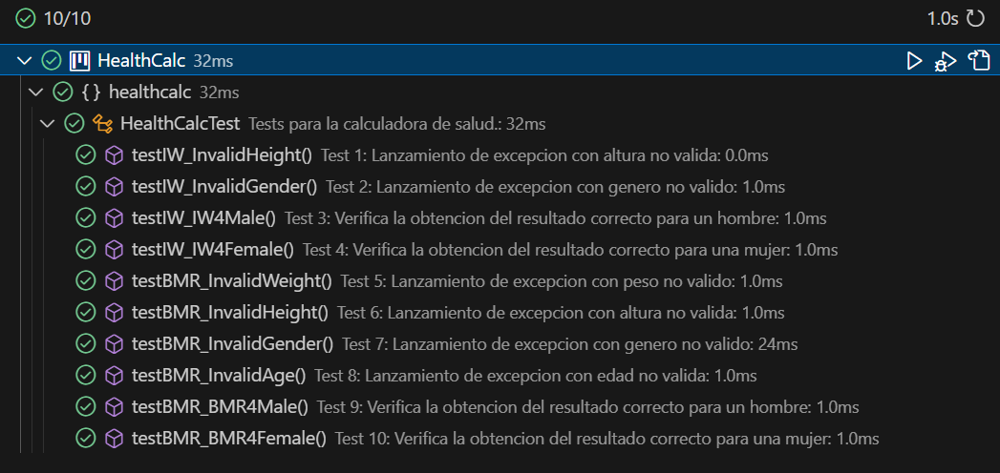
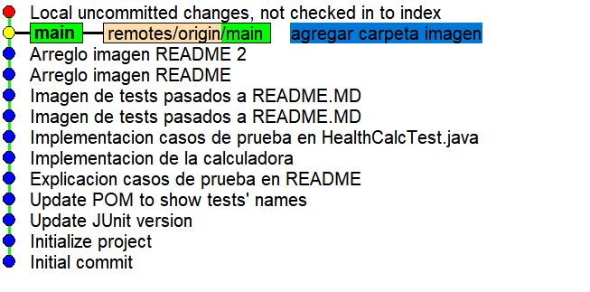
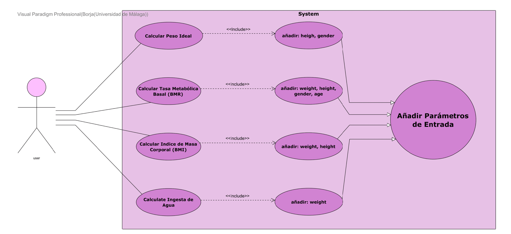

Health calculator

# Practica 1
En esta practica se nos pide enumar los casos de prueba para la calculadora usando un lenguaje llano. A continuacion se presentan los tests subdivididos en los dos metodos:

## Ideal Weight (IW)

- **TEST 1: Invalid Height**
    - Descripcion: Lanza un error cuando el parametro Height no es valido.
    - Input: Valor negativo o cero de Height.
    - Output Esperado: Error indicando el motivo.

- **TEST 2: Invalid Gender**
    - Descripcion: Lanza un error cuando el parametro Gender no es valido.
    - Input: Valor diferente de "m" o "w".
    - Output Esperado: Error indicando el motivo.

- **TEST 3: IW for Male**
    - Descripcion: Calcula el peso ideal para un hombre.
    - Input: Altura (Height) y género (Gender).
    - Output Esperado: Peso ideal en kg.

- **TEST 4: IW for Female**
    - Descripcion: Calcula el peso ideal para una mujer.
    - Input: Altura (Height) y género (Gender).
    - Output Esperado: Peso ideal en kg.
    
## Basal Metabolic Rate (BMR)

- **TEST 5: Invalid Weight**
    - Descripcion: Lanza un error cuando el parametro Weight no es valido.
    - Input: Valor negativo o cero de Weight.
    - Output Esperado: Error indicando el motivo.

- **TEST 6: Invalid Height**
    - Descripcion: Lanza un error cuando el parametro Height no es valido.
    - Input: Valor negativo o cero de Height.
    - Output Esperado: Error indicando el motivo.

- **TEST 7: Invalid Gender**
    - Descripcion: Lanza un error cuando el parametro Gender no es valido.
    - Input: Valor diferente de "m" o "w".
    - Output Esperado: Error indicando el motivo.

- **TEST 8: Invalid Age**
    - Descripcion: Lanza un error cuando el parametro Age no es valido.
    - Input: Valor negativo o cero de Age.
    - Output Esperado: Error indicando el motivo.

- **TEST 9: BMR for Male**
    - Descripcion: Calcula el BMR para un hombre.
    - Input: Altura (Height), género (Gender), peso (Weight) y edad (Age).
    - Output Esperado: Valor del BMR.

- **TEST 10: BMR for Female**
    - Descripcion: Calcula el BMR para una mujer.
    - Input: Altura (Height), género (Gender), peso (Weight) y edad (Age).
    - Output Esperado: Valor del BMR.

Una vez definidos los tests, se ha implementado la calculadora en el archivo "HealthCalcImpl.java" y los tests en "HealthCalcTest.java". Podemos ver que todos los tests pasan correctamente en la siguiente imagen:
    

Tras varios intentos de que se vea la imagen en este archivo, queda un arbol de la siguiente forma:
    

# Practica 2
Este es el diagrama de casos de uso:
    

## Especificación de Caso de Uso (Peso Ideal)
    Nombre: Calculo del Peso Ideal.
    Actor Principal: Usuario.
    Alcance: Aplicación calculadora de salud.
    Nivel: user-goal.
    StakeHolders:
        - Usuario que quiere conocer su peso ideal.
    Precondiciones: La aplicacion es funcional para el usuario.
    Garantías Mínimas: Lanza un mensaje de error en caso de fallo.
    Garantías de Éxito: Devuelve el peso ideal.
    Escenario Principal:
        1. El usuario selecciona la opcion  "Peso Ideal".
        2. El usuario introduce los parámetros necesarios.
        3. El sistema devuelve el resultado.
    Extensiones:
        2a. Parámetros incorrectos.
            2a1. Muestra un mensaje de error indicando los parametros erróneos. Vuelve a paso 2.

