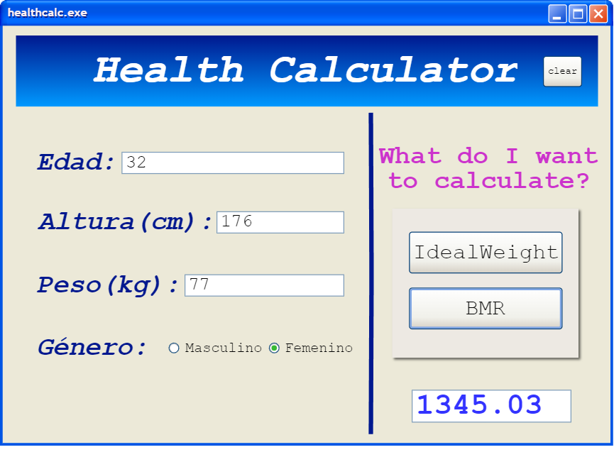

Health calculator

# Practica 1
En esta practica se nos pide enumar los casos de prueba para la calculadora usando un lenguaje llano. A continuacion se presentan los tests subdivididos en los dos metodos:

## Ideal Weight (IW)

- **TEST 1: Invalid Height**
    - Descripcion: Lanza un error cuando el parametro Height no es valido.
    - Input: Valor negativo o cero de Height.
    - Output Esperado: Error indicando el motivo.

- **TEST 2: Invalid Gender**
    - Descripcion: Lanza un error cuando el parametro Gender no es valido.
    - Input: Valor diferente de "m" o "w".
    - Output Esperado: Error indicando el motivo.

- **TEST 3: IW for Male**
    - Descripcion: Calcula el peso ideal para un hombre.
    - Input: Altura (Height) y género (Gender).
    - Output Esperado: Peso ideal en kg.

- **TEST 4: IW for Female**
    - Descripcion: Calcula el peso ideal para una mujer.
    - Input: Altura (Height) y género (Gender).
    - Output Esperado: Peso ideal en kg.
    
## Basal Metabolic Rate (BMR)

- **TEST 5: Invalid Weight**
    - Descripcion: Lanza un error cuando el parametro Weight no es valido.
    - Input: Valor negativo o cero de Weight.
    - Output Esperado: Error indicando el motivo.

- **TEST 6: Invalid Height**
    - Descripcion: Lanza un error cuando el parametro Height no es valido.
    - Input: Valor negativo o cero de Height.
    - Output Esperado: Error indicando el motivo.

- **TEST 7: Invalid Gender**
    - Descripcion: Lanza un error cuando el parametro Gender no es valido.
    - Input: Valor diferente de "m" o "w".
    - Output Esperado: Error indicando el motivo.

- **TEST 8: Invalid Age**
    - Descripcion: Lanza un error cuando el parametro Age no es valido.
    - Input: Valor negativo o cero de Age.
    - Output Esperado: Error indicando el motivo.

- **TEST 9: BMR for Male**
    - Descripcion: Calcula el BMR para un hombre.
    - Input: Altura (Height), género (Gender), peso (Weight) y edad (Age).
    - Output Esperado: Valor del BMR.

- **TEST 10: BMR for Female**
    - Descripcion: Calcula el BMR para una mujer.
    - Input: Altura (Height), género (Gender), peso (Weight) y edad (Age).
    - Output Esperado: Valor del BMR.

Una vez definidos los tests, se ha implementado la calculadora en el archivo "HealthCalcImpl.java" y los tests en "HealthCalcTest.java". Podemos ver que todos los tests pasan correctamente en la siguiente imagen:
    

Tras varios intentos de que se vea la imagen en este archivo, queda un arbol de la siguiente forma:
    

# Practica 2
Este es el diagrama de casos de uso donde hemos añadido dos nuevos casos de uso, IMC (peso/(altura^2)) e ingesta de agua diaria (peso*0.03)
    

## Especificación de Caso de Uso (Peso Ideal)
    Nombre: Calculo del Peso Ideal.
    Actor Principal: Usuario.
    Alcance: Aplicación calculadora de salud.
    Nivel: user-goal.
    StakeHolders:
        - Usuario que quiere conocer su peso ideal.
    Precondiciones: La aplicacion es funcional para el usuario.
    Garantías Mínimas: Lanza un mensaje de error en caso de fallo.
    Garantías de Éxito: Devuelve el peso ideal.
    Escenario Principal:
        1. El usuario selecciona la opcion  "Peso Ideal".
        2. El usuario introduce los parámetros necesarios.
        3. El sistema devuelve el resultado.
    Extensiones:
        2a. Parámetros incorrectos.
            2a1. Muestra un mensaje de error indicando los parametros erróneos. Vuelve a paso 2.

# Practica 4
En esta practica se nos pide realizar una interfaz grafica para nuestra aplicacion. En primer lugar, crearemos un prototipo usando el software "Pencil Project". Mas adelante desarrollaremos esta interfaz utilizando el entorno de desarrollo integrado en Eclipse, denominado "WindowBuilder".

## Prototipo

## Implementacion Final

## Ejecutable .jar
Hemos obtenido el .jar a traves del entorno de eclipse y para probarlo se ha utilizado el siguiente comando:
    java -jar healthcalc.jar  

# Practica 6
En esta practica hemos implementado cuatro patrones de diseño para satisfacer diferentes necesidades. A su vez, se han probado en el archivo Main.java para ver que en efecto todos funcionan. A continuacion se muestran los diagramas de todos los patrones:

## Patron Singular
Este patrón nos garantiza que solo una instancia de la calculadora esté disponible en la aplicación, evitando la creación de múltiples instancias que podrían causar conflictos y comportamientos inesperados.
    

## Patron Adapter
Este patrón nos permite adaptar la interfaz a la interfaz específica requerida por el hospital Costa del Sol de Marbella, teniendo en cuenta que este hospital usa la altura en metros y el peso en gramos.
    

## Patron Proxy
Este patrón implementa la interfaz HealthStats, permitiendo registrar datos de los pacientes de forma anónima y calcular estadísticas, como la media de los valores introducidos y calculados.
    

## Patron Decorador
Este patrón nos permite agregar a la calculadora la gestión de unidades de medida (europeas o americanas) y la visualización de mensajes de salida en dos idiomas (español e inglés).
    

## Pruebas
Estas son las pruebas del main.java
    

# Practica 7

## Refactoring 1
- Bad smell:
    - Principio de segregación de interfaces
- Refactorizacion:
    - Extracción de clases.
    - Hacemos una interfaz para cada operación, diviendo la interfaz original en dos.
- Tipo:
    - Class Refactoring
- Descripcion:
    - HealthCalcImp tiene ahora dos objetos nuevos (CardiovascularMetricsImpl y MetaboliMetricsImpl) que usa para implementar los metodos.
- Cambios:
    - Creacion de dos interfaces nuevas (MetabolicMetrics y CardiovascularMetrics), 
    - Implementacion de ambas interfaces en 2 nuevas clases, 
    - Modificacion de 2 métodos de HealthCalcImpl
    - Se añaden 2 objetos a la clase HealthCalcImpl.

## Refactoring 2
- Bad smell:
    - Tipos numericos diferentes
- Refactorizacion:
    - Modificacion de tipo de dato.
    - Cambiamos el tipo de diferentes variables.
- Tipo:
    - Method Refactoring
- Descripcion:
    - Cambiamos la salida de float a double y por tanto cambiamos todas las instancias de tipo.
- Cambios:
    - Cambiamos tipo en metodos CardiovascularMetrics y MetabolicMetrics
    - Cambiamos tipo en metodos CardiovascularMetricsImpl y MetabolicMetricsImpl
    - Cambiamos tipo en dos metodos en HealthCalcImpl
    - Cambiamos tipo en dos metodos en HealthCalc
    - Cambiamos dos tipos en metodo de Controlador

## Refactoring 3
- Bad smell:
    - Tipo de variable de genero incorrecta.
- Refactorizacion:
    - Modificacion de tipo de dato.
- Tipo:
    - Attribute Refactoring
- Descripcion:
    - Creamos el enumerador Gender, cambiamos los char='m' a Gender.MALE y los char='w' a Gender.FEMALE.
- Cambios:
    - Creamos enum Gender.
    - Cambiamos de char a Gender en Controlador, adapter, CardiovascularMetrics, CardiovascularMetricsImpl, MetabolicMetrics, MetabolicMetricsImpl, HealthCalc y HealthCalcImpl.

## Refactoring 4
- Bad smell:
    - Muchos parámetros de entrada.
- Refactorizacion:
    - Eliminacion de parámetros por medio de un objeto.
- Tipo:
    - Class Refactoring
- Descripcion:
    - Creamos la interfaz Person y creamos su implementacion la cual tiene metodos para obtener los parametros y dos constructores para los dos tipos de calculos.
- Cambios:
    - Creamos interfaz Person
    - Creamos clase PersonImpl
    - Cambiamos a tipo person la entrada en CardiovascularMetrics, CardiovascularMetricsImpl, HealthCalc, HealthCalcImpl, MetabolicMetrics y MetabolicMetricsImpl.
    - Creamos objeto person con los datos en Controlador y Adapter

        

